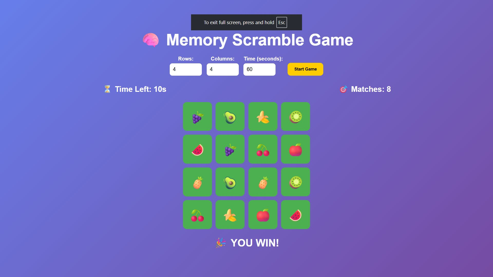

# 🧠 Memory Scramble Game

A browser-based memory card matching game built with HTML, CSS, and vanilla JavaScript.

## 🌐 Live Demo

🔗 **[Play the game here](https://abdallahibrahim27.github.io/Memory-Scramble-Game/)**



## 🎮 How to Play

1. Set the number of **Rows** and **Columns** for the board (must be even total)
2. Set the **time limit** in seconds
3. Click **Start Game**
4. Click on any card to flip it and reveal the emoji
5. Try to find its matching pair by flipping a second card
6. Matched pairs stay face-up — unmatched pairs flip back over
7. Match all pairs before the timer runs out to **win!**

## 📋 Game Rules

- The total number of cards (Rows × Columns) **must be even**
- You can only flip **2 cards at a time**
- Matched cards stay revealed until the game ends
- If the timer reaches **0** before all pairs are matched → **Game Over**
- Match all pairs in time → **You Win! 🎉**

## 🚀 How to Run

No installation or build tools required.

### Option 1 — Open directly in browser

1. Download or clone this repository
2. Open `index.html` in any modern web browser (Chrome, Firefox, Edge, Safari)

```bash
git clone https://github.com/abdallahibrahim27/Memory-Scramble-Game.git
cd memory-scramble-game
# Open index.html in your browser
```

### Option 2 — Use a local server (optional)

If you have VS Code, you can use the **Live Server** extension:

1. Right-click `index.html`
2. Select **"Open with Live Server"**

Or with Python:

```bash
# Python 3
python -m http.server 8000
# Then open http://localhost:8000 in your browser
```

## 📁 Project Structure

```
memory-scramble-game/
│
├── index.html      # Main HTML page and game layout
├── style.css       # Styling and animations
├── script.js       # Game logic (board generation, timer, card matching)
└── README.md       # This file
```

## ⚙️ Configuration Options

| Setting | Min | Max | Default |
|--------|-----|-----|---------|
| Rows | 2 | 6 | 4 |
| Columns | 2 | 6 | 4 |
| Time (seconds) | 10 | — | 60 |

> **Note:** Rows × Columns must result in an even number (e.g., 4×4=16 ✅, 3×3=9 ❌)

## 🛠️ Built With

- **HTML5**
- **CSS3** (Grid, Flexbox, Transitions)
- **Vanilla JavaScript** (No frameworks or libraries)

## 👥 Team Members

| Name | ID |
|------|----|
| [Member 1 Name] | [ID] |
| [Member 2 Name] | [ID] |
| [Member 3 Name] | [ID] |
